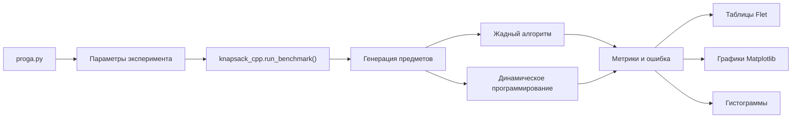

# Knapsack Problem Lab

<p align="center">
  <b>Курсовая работа по исследованию алгоритмов решения задачи о рюкзаке</b>
</p>

<p align="center">
  
  
  
  
</p>

## О проекте

`Knapsack Problem Lab` - это графическое приложение для сравнения точного и приближенного подходов к решению классической задачи о рюкзаке.

Проект объединяет интерфейс на `Python/Flet` и вычислительный модуль на `C++17`, подключенный через `pybind11`. C++ часть генерирует наборы предметов, запускает алгоритмы и возвращает результаты бенчмарков, а Python часть отображает таблицы, графики и гистограммы для анализа.

Приложение помогает наглядно оценить, как жадный алгоритм отличается от точного решения динамическим программированием по времени работы, итоговой ценности и погрешности.

## Что умеет

- генерирует наборы предметов для разных типов распределений;
- сравнивает динамическое программирование и жадный алгоритм;
- измеряет время работы алгоритмов на разных размерах входных данных;
- считает итоговую ценность выбранных предметов;
- вычисляет относительную погрешность жадного алгоритма;
- строит графики времени, ценности, количества выбранных предметов и ошибки;
- показывает гистограммы весов и ценностей входных данных;
- поддерживает переключение между темной и светлой темой интерфейса.

## Модель

| Обозначение | Смысл | Значение в проекте |
|---|---|---:|
| `W` | вместимость рюкзака | `400` |
| `N` | количество предметов | от `1` до `10 000 000` |
| `w_min` | минимальный вес предмета | `1` |
| `w_max` | максимальный вес предмета | `350` |
| `seed` | seed генератора случайных чисел | `225` |
| `alpha` | коэффициент ценности в жадном приоритете | зависит от распределения |
| `beta` | коэффициент веса в жадном приоритете | зависит от распределения |

### Типы распределений

| Распределение | Идея |
|---|---|
| `EQUAL` | ценность пропорциональна весу |
| `REVERSE_DOWN` | обратная зависимость ценности от веса |
| `REVERSE_UP` | прямая нелинейная зависимость ценности от веса |
| `CHAOTIC` | случайная генерация ценностей |

## Алгоритмы

### Динамическое программирование

Точный алгоритм, который строит таблицу оптимальных значений для всех промежуточных вместимостей рюкзака.

```text
Сложность по времени: O(N * W)
Сложность по памяти: O(N * W)
```

### Жадный алгоритм

Приближенный алгоритм, который сортирует предметы по приоритету и последовательно добавляет подходящие предметы в рюкзак.

В проекте используется приоритет:

```text
priority = alpha * log(price) - beta * log(weight)
```

```text
Сложность по времени: O(N log N)
Сложность по памяти: O(N)
```

## Метрики

| Метрика | Описание |
|---|---|
| `time_greedy` | время работы жадного алгоритма |
| `time_ds` | время работы динамического программирования |
| `greedy_value` | итоговая ценность решения жадного алгоритма |
| `ds_value` | итоговая ценность точного решения |
| `greedy_count` | количество предметов, выбранных жадным алгоритмом |
| `ds_count` | количество предметов, выбранных точным алгоритмом |
| `error_pct` | ошибка жадного алгоритма относительно точного решения |

## Как устроен проект

```text
.
├── proga.py             # Flet-интерфейс, графики, таблицы и визуализация
├── knapsack_cpp.cpp     # C++ генерация данных и реализация алгоритмов
├── setup.py             # сборка C++ модуля knapsack_cpp
├── requirements.txt     # Python-зависимости проекта
├── instruction.txt      # заметки по сборке на Windows
└── .gitignore           # исключения для Git
```

## Быстрый старт

### 1. Клонировать репозиторий

```bash
git clone https://github.com/kek2774/knapsackProblem.git
cd knapsackProblem
```

### 2. Создать виртуальное окружение

```powershell
python -m venv .venv
.\.venv\Scripts\Activate.ps1
```

Если PowerShell запрещает запуск скриптов, можно временно разрешить их для текущей сессии:

```powershell
Set-ExecutionPolicy -Scope Process -ExecutionPolicy Bypass
.\.venv\Scripts\Activate.ps1
```

### 3. Установить зависимости

```powershell
pip install -r requirements.txt
```

### 4. Собрать C++ модуль

Для сборки на Windows нужен установленный компилятор C++. Удобнее всего открыть **x64 Native Tools Command Prompt for VS 2022** или терминал, где доступен компилятор Visual Studio.

```powershell
python setup.py build_ext --inplace
```

После успешной сборки в папке проекта появится файл расширения:

```text
knapsack_cpp.cp313-win_amd64.pyd
```

Название может отличаться в зависимости от версии Python и операционной системы.

### 5. Запустить приложение

```powershell
python proga.py
```

## Как пользоваться

После запуска приложение открывает интерфейс с навигацией по трем разделам:

- **Точный алгоритм** - результаты динамического программирования;
- **Жадный алгоритм** - результаты приближенного решения;
- **Сравнение** - сводные графики для двух подходов.

В интерфейсе можно выбирать активные распределения, сравнивать графики времени и ценности, анализировать ошибку жадного алгоритма и смотреть гистограммы входных данных.

## Архитектура



## Пример использования C++ модуля без интерфейса

```python
import knapsack_cpp

rows = knapsack_cpp.run_benchmark(
    dist=knapsack_cpp.Distribution.EQUAL,
    counts=[10, 100, 1000],
    capacity=400,
    w_min=1,
    w_max=350,
    seed=225,
    alpha=1.0,
    beta=1.0,
)

for row in rows:
    print(row.items_count, row.greedy_value, row.ds_value, row.error_pct)
```

Перед запуском такого кода модуль `knapsack_cpp` должен быть собран командой:

```powershell
python setup.py build_ext --inplace
```

## Интерпретация результатов

Динамическое программирование используется как эталон, потому что находит оптимальное решение. Жадный алгоритм работает быстрее, но может давать решение хуже оптимального.

Если процент ошибки близок к нулю, жадный алгоритм на данном распределении хорошо приближает точное решение. Если ошибка растет, значит выбранный приоритет хуже подходит для структуры входных данных.

Сравнение времени показывает практическую разницу между точным и приближенным подходом: динамическое программирование дает лучший результат, но требует больше вычислений, а жадный алгоритм подходит для больших наборов данных.

## Возможные проблемы

### `ModuleNotFoundError: No module named 'knapsack_cpp'`

C++ модуль еще не собран. Выполните:

```powershell
python setup.py build_ext --inplace
```

### Ошибка компиляции на Windows

Проверьте, что установлен Visual Studio Build Tools с компонентом C++ и команда выполняется из терминала, где доступен компилятор.

### Долгий запуск

При старте приложение выполняет серию бенчмарков для разных размеров входных данных. На слабом компьютере первичная подготовка результатов может занять некоторое время.

## Для сдачи курсовой

Проект содержит расчетную часть, C++ ускорение, графический интерфейс и визуальный анализ результатов. README можно использовать как краткое описание перед демонстрацией: в нем есть формулировка задачи, описание алгоритмов, метрики, структура проекта и инструкция по запуску.
